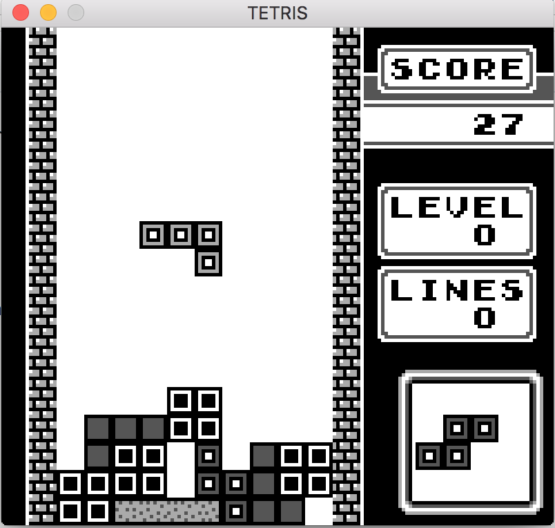
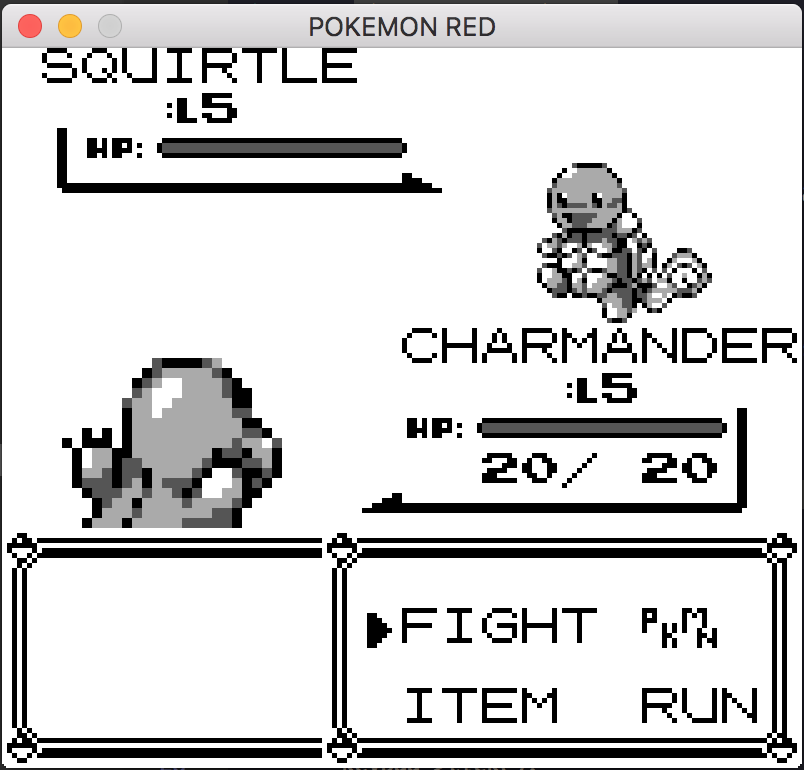

# GB-Emulator
A cross-platform Gameboy Emulator written in modern C++.

<p float="left">


</p>

## Dependencies
Make sure you have a C++14 compiler ready and [SFML](https://www.sfml-dev.org/) installed, and you are set to go.

## Building
```sh 
git clone https://github.com/marvrez/GB-Emulator.git
cd GB-Emulator/
mkdir build
cd build
cmake ..
make
```
## Run
You can run the emulator as follows, assuming you are still in the newly created `build`-folder.

```sh
./myproject <RELATIVE_PATH_TO_ROM>
```
Where the path is relative to where the executable is placed.

Alternatively, you can try building and running it in Visual Studio or QT Editor, and just pass the desired ROM as argument.

## Controls

Key   | Gameboy button
------------|-----
Z         | B
X         | A
Enter         | Start
Space         | Select
